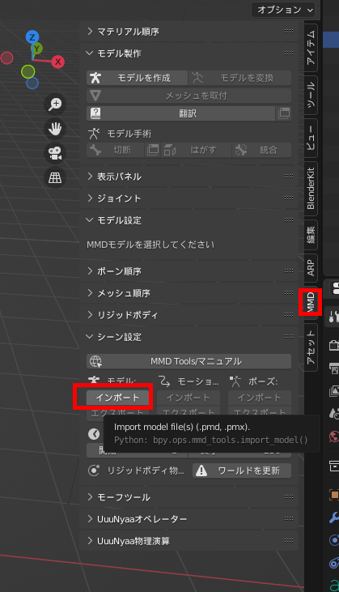

# blenderでMMDのモーフを追加する

* 前提:blenderにmmd_toolsがインストールされていること

1. MMDモデルを読み込む  
  

2. モーフツールから＋を押して新しいMMDモーフを追加

  

3. ダブルクリックして名前を変更

  

4. モデルのメッシュを選択して、プロパティの緑の逆三角にあるblenderのシェイプキーに同じ名前のモーフを追加

  

5. モーフの数値を1.0にした後、メッシュを修正する（ここではスカルプトのグラブブラシで修正している）
  

https://user-images.githubusercontent.com/44924233/180204606-2d446b7b-ca03-4110-8170-4d6ec7eedf40.mp4

* 参考：材質（メッシュ）を分離しなくても、ブラシ＞自動マスク：トポロジーをチェックするとトポロジー的につながっている部分のみ修正できる

  

6. MMDモデルをエクスポートする

  
